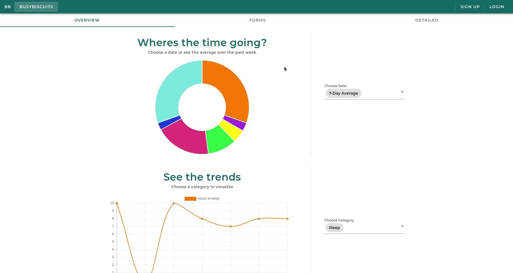
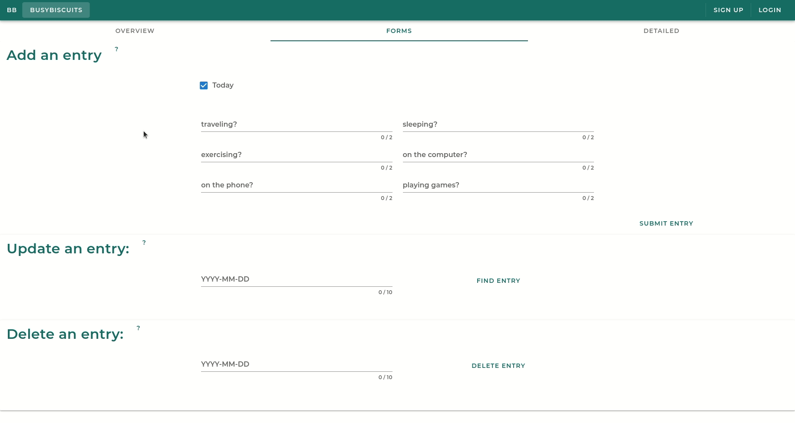
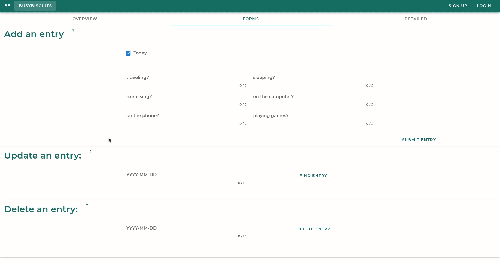
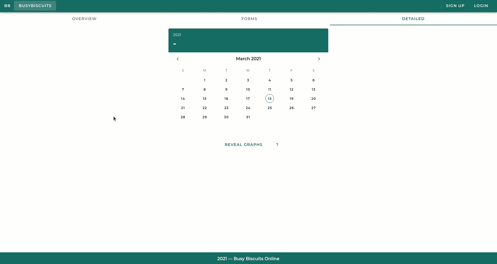

# BusyBiscuits - Time Tracking Web Application 2.0

## Table of contents
1. [Techstack](#stack)
2. [What am I looking at?](#description)
3. [Recreate setup](#setup)
4. [Inspiration](#inspiration)
5. [Possible future additions](#future)
6. [Screenshots of the application](#screenshots)

## Techstack <a name="stack"></a>
- Vuejs (Vuetify & Vuex)
- Node + Express
- Chartjs

## What am I looking at? <a name="description"></a>
This is a repo for a time tracking application. This web app allows the user to enter in time spent on specific things (i.e. sleep, traveling, etc.). Then that data is visualized through pie charts and line graphs giving the user a better understanding of how their time is spent. 

This is a full stack application with three main layers. The Vue frontend, a Node+Express backend, and a MySql database. The frontend sends axios calls to the backend endpoints which then query the MySql database. 

You can see gifs of the application towards the bottom. The app has three main tabs, an overview, a forms tab, and a detailed tab. The overview just shows a line graph and a pie chart of data over the last seven entries (or up to). The next tab includes the forms to add entries, update entries, and remove them. The last tab includes a date picker that allows the user to get graphs of entries based on one date or a range of dates  

## Recreate setup <a name="setup"></a>
- There is a slight issue with trying to recreate this application which is the database part. Without the database itself, you cannot get this to work on your machine 100%. However if you want to just look at the frontend, that can happen (might include a sql script to create the database needed in the future).
- Clone the repo to your local machine. Once cloned, perform the following commands:
```
cd client
npm install
```
- Github's dependabot complained about a couple of packages. Specifically 'ssri' and 'is-svg'. I tried to research how to update the package-lock.json to get the right versions of these packages that do no have the security issues but could not solve the issue. Both packages are required dependencies for @vue/cli-service. The best thing I did was to install the latest versions manually using the following commands:
```
npm install ssri@latest --save
npm install is-svg@latest --save
```
- To run the server:
```
npm run serve
```
- This will get the client side running. Then open a browser and go to
```
http://localhost:8080
```

## Inspiration <a name="inspiration"></a>
I noticed the more I track where my times goes, the more productive I am. Plus, I wanted to get better with this techstack. So, I figured why not kill 2 birds with one stone; create an application that I could see myself using as well as getting more experience in creating fullstack applications. This is not the end all be all time tracking application. But, I thought this would be a great project to work on. 

## Possible future additions <a name="future"></a>
I worked on this project for almost a month back in August 2020. I completed my MVP which was to get entries from a user and visualize the inputs through charts. However, coming back to the project, I have been able to add onto it. I reworked the UI and now the user can perform CRUD (create, read, update, and delete) operations on the entry.

However, there is always things to add. The following are some features I may add in the future: 

[X] Add a way to update and delete entries to give more control to the user and to make this an official CRUD app

[X] Add more types of graphs and tables to help give the user more information on their time spent (I checked this off because although I did not add more types of graphs, I think the UI gives the user more information from the 'detailed' tab of the application)

[] Allow for the user to create custom entries so that they can different things that are more important to them (ex. money or weight). As of right now, there are only 6 categories that the user can track

[] Create user accounts (Login and Sign-In buttons and forms are there. Just need tie to the data to the user)

[] Add security features so that I can publish the website online

[] Publish just the frontend with a mockbackend so that there is no need for security, just so showcase the app

## A few screenshots of the application <a name="screenshots"></a>

### Overview Tab - Shows the pie chart and the line graph over the past seven entries


### Adding an entry on the forms tab
 

### Updating an entry
 

### Removing an entry
 

### Detailed Tab - Choose dates on the date picker and see the generated graphs
 

- Because the login and signin forms are not tied to the data in the app and not implemented, I will not include the screenshot of them