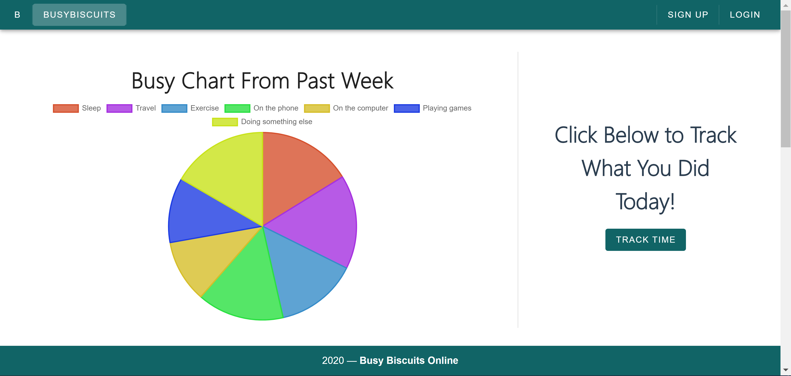
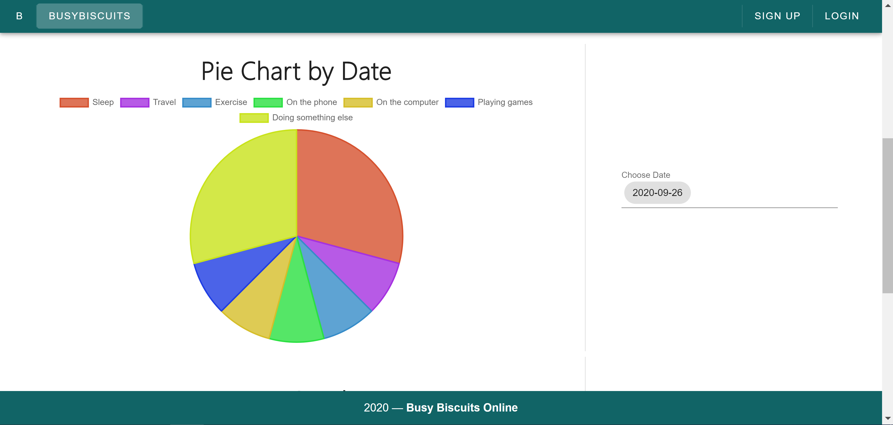
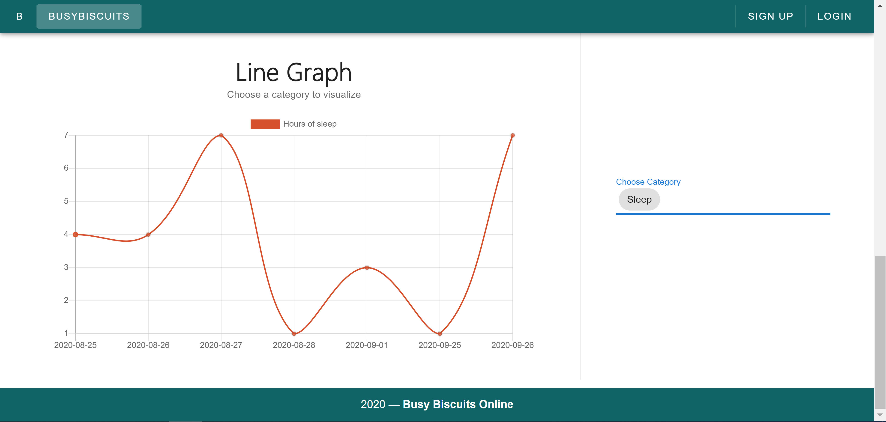
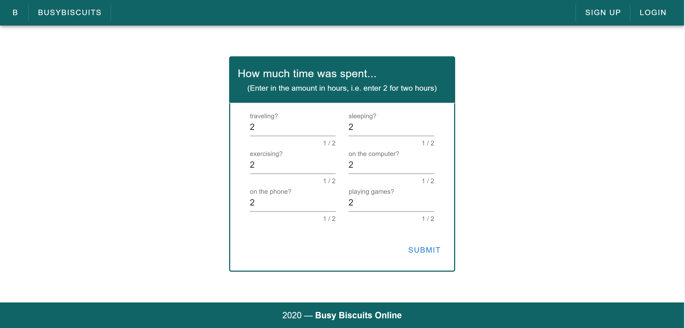

# BusyBiscuits - Time Tracking Web Application (BACK IN PRODUCTION, WORKING ON 'Possible future additions right now so there may be some changes to the content of the readme)

## Table of contents
1. [Techstack](#stack)
2. [What am I looking at?](#description)
3. [Inspiration](#inspiration)
4. [Possible future additions](#future)
5. [Screenshots of the application](#screenshots)

## Techstack 
- Vuejs (Vuetify & Vuex)
- Node + Express
- Chartjs

## What am I looking at? 
This is a repo for a time tracking application. This web app allows the user to enter in time spent on specific things (i.e. sleep, traveling, etc.). Then that data is visualized through pie charts and line graphs giving the user a better understanding of how their time is spent.

## Inspiration 
I feel like my time management skills are at a good point at this moment in time. I am able to achieve a level of production that I am happy with. But, there is always improvement and I thought a good way to take it to the next level would be to visualize it and get a better understanding of how my time is spent. By visualizing my time, I would be able to see trends and maybe spot some weakpoints and adjust my habits to become more productive

So, I figured why not kill 2 birds with one stone; create an application that I could for myself as well as getting more experience in creating fullstack application. This is not the end all be all time tracking application. But, I thought this would be a great project to work on. 

## Possible future additions 
When I first started this application, my MVP was to be able to input data and then visualize it. Fortunately, at this point in time, that has been achieved. I am able to fill out the form, submit it, and see the data visualized.

However, there is always things to add. The following are some of the main features that I would want to add (School and life is taking over at the time of writing this so, these additions will not come for the forseable future ): ) 

- Add a way to update and delete entries to give more control to the user and to make this an official CRUD app
- Add more types of graphs and tables to help give the user more information on their time spent
- Allow for the user to create custom entries so that they can different things that are more important to them (ex. money or weight). As of right now, there are only 6 categories that the user can track. 
- Create user accoutns (Login and Sign-In buttons and forms are there. Just need tie to the data to the user)

## A few screenshots of the application 

- Dashboard - Main Pie Chart - Shows data from the last past days (All the following graphs are all on one page)

- Dashboard - Second Pie Chart - Shows data from a chosen date
 

- Dashboard - Line Graph - Shows data from past 7 days based on chosen category
 

- Date entry form
 

- Because the login and signin forms are not tied to the data in the app and not implemented, I will not include the screenshot of them. However, it does look similar to the 'Data entry form' above